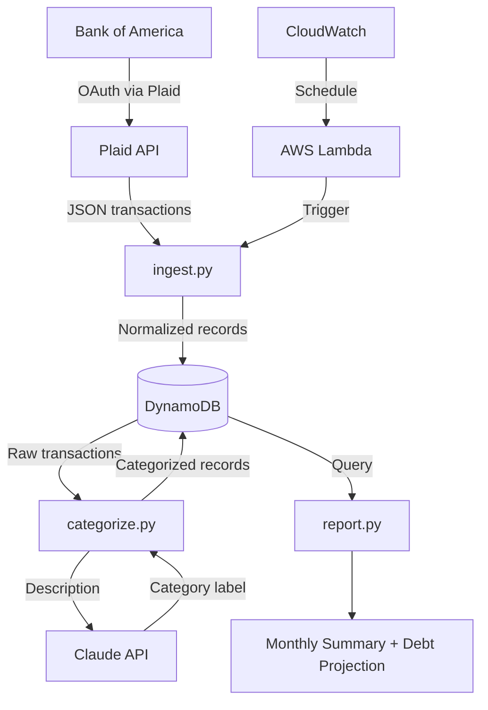

# finance-pipeline

Personal finance data pipeline: BofA → Plaid → DynamoDB → Claude categorization → monthly reports.

Built in 6 weeks as a portfolio project for data engineering roles.

---

## Architecture



| Week | Layer | Status |
|------|-------|--------|
| 1 | Plaid ingestion + repo setup | ✅ Done |
| 2 | DynamoDB write + rule-based categorization | ✅ Done |
| 3 | Lambda + CloudWatch schedule | ✅ Done |
| 4 | Claude API categorization | ✅ Done |
| 5 | Report output | ✅ Done |
| 6 | Cleanup + apply | ✅ Done |

---

## How I Built This

I had $0/month and no persistent server — every architecture decision follows that.

Plaid for sandbox level functionality due to its free tier. Plaid production tier is priced so Plaid sandbox tier is a deliberate choice not limitation. 

Lambda + CloudWatch for scheduled ingestion of data. Lambda is handsoff AWS feature which can be used to execute a function file without any need to monitor and setting up the remote box process. Its a low effort option compared to EC2. 

CloudWatch trigger Lambda once per 24 hours. Even if the local machine is sleeping the CloudWatch won't be affected. In case of the trigger results in an error, it doesn't retry, so we could notice the days the results missed as the days errors occured.

Lambda + Rust issue: anthropic's pydantic_core dep is Rust-compiled. Building on macOS produces a macOS binary. Lambda runs on Linux. Cold start fails with ImportError. Fix: rebuild package/ with --platform manylinux2014_x86_64 --only-binary=:all:. That's the failure-recovery story.

DynamoDB is chosen for datastorage due to its flexible price + serverless feature, compared to RDS where the server is running 24/7 and after 12 free months its $15/month. Dynamo also wires directly to lambda without any need for VPC or connections. 

Claude API for categorization because transactions are free-text with many variations and a long tail that no rule based keyword map can accommodate. The cost is latency network call per transaction vs dict look ups and it works if 50 txns/month -> $0.001/txn claude haiku but not if 50K txns/month.

Silent degrade-to-other as a fallback for when the Claude API is down or if the category doesn't fit pattern-based keyword map, instead of failing.
---

## Setup

```bash
# 1. Clone and install
git clone https://github.com/HarshPatel7x/finance-pipeline
cd finance-pipeline
pip install -r requirements.txt

# 2. Add credentials
cp .env.example .env
# Fill in PLAID_CLIENT_ID and PLAID_SECRET from dashboard.plaid.com

# 3. Run
python -m src.ingest              # Plaid sandbox (requires .env)
python -m src.ingest --sample     # local sample data (no credentials needed)
```

## Environment variables

| Variable | Description |
|----------|-------------|
| `PLAID_CLIENT_ID` | From Plaid dashboard |
| `PLAID_SECRET` | Sandbox or development secret |
| `PLAID_ENV` | `sandbox` / `development` / `production` |
| `ANTHROPIC_API_KEY` | From console.anthropic.com — fallback categorizer when keyword rules return "Other" |

**Never commit `.env`.** Real bank credentials stay local only.
