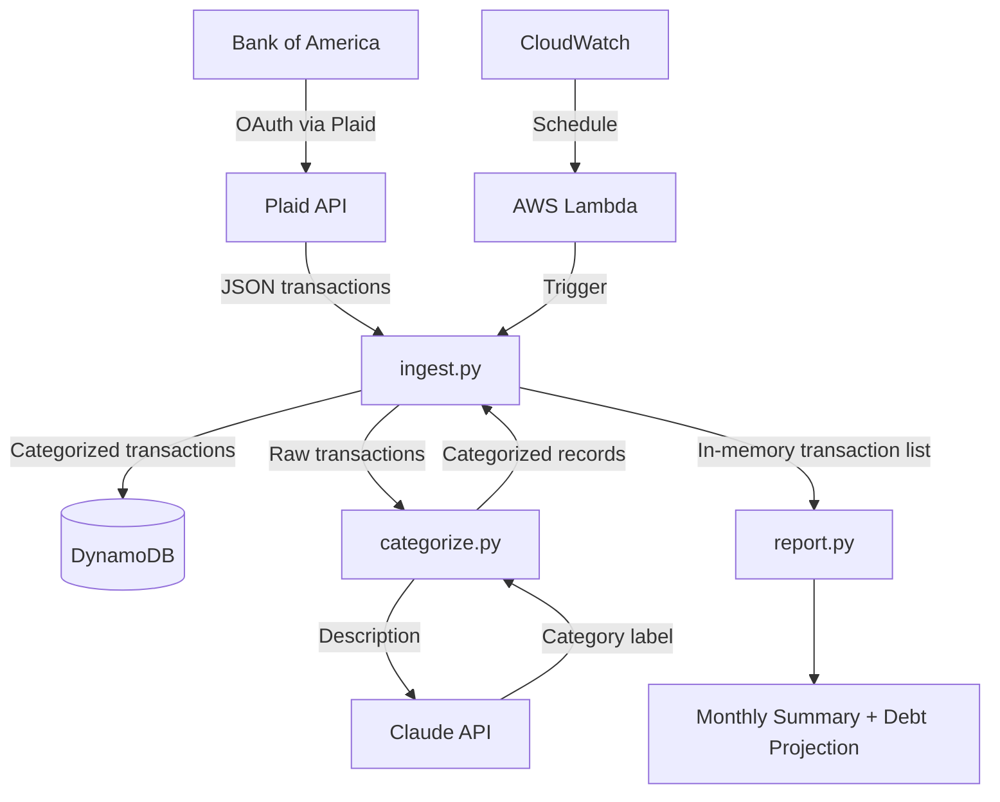

# finance-pipeline

Personal finance data pipeline: BofA → Plaid → DynamoDB → Claude categorization → monthly reports.

Built in 6 weeks as a portfolio project for data engineering roles.

---

## Architecture



| Week | Layer | Status |
|------|-------|--------|
| 1 | Plaid ingestion + repo setup | ✅ Done |
| 2 | DynamoDB write + rule-based categorization | ✅ Done |
| 3 | Lambda + CloudWatch schedule | ✅ Done |
| 4 | Claude API categorization | ✅ Done |
| 5 | Report output | ✅ Done |
| 6 | Cleanup + apply | ✅ Done |

---

## Categorization metrics

Every run reports how transactions were classified — free keyword rules vs. the
Claude API fallback — and what the LLM calls cost in tokens. A sample run
(`python -m src.ingest --sample`):

| Metric | Value |
|--------|-------|
| Transactions | 12 |
| Keyword path | 7 |
| Claude path | 5 |
| Input tokens | 337 |
| Output tokens | 26 |

The keyword/Claude split is the cost lever: keyword hits are free and instant;
Claude calls cost tokens and a network round-trip. At ~50 transactions/month the
LLM tail is negligible; at 50k/month it is the line item to watch — so the split
is measured per run, not assumed.

---

## How I Built This

I had $0/month and no persistent server — every architecture decision follows that.

Plaid for sandbox level functionality due to its free tier. Plaid production tier is priced so Plaid sandbox tier is a deliberate choice not limitation. 

Lambda + CloudWatch for scheduled ingestion of data. Lambda is handsoff AWS feature which can be used to execute a function file without any need to monitor and setting up the remote box process. Its a low effort option compared to EC2. 

CloudWatch trigger Lambda once per 24 hours. Even if the local machine is sleeping the CloudWatch won't be affected. In case of the trigger results in an error, it doesn't retry, so we could notice the days the results missed as the days errors occured.

Lambda + Rust issue: anthropic's pydantic_core dep is Rust-compiled. Building on macOS produces a macOS binary. Lambda runs on Linux. Cold start fails with ImportError. Fix: rebuild package/ with --platform manylinux2014_x86_64 --only-binary=:all:. That's the failure-recovery story.

DynamoDB is chosen for datastorage due to its flexible price + serverless feature, compared to RDS where the server is running 24/7 and after 12 free months its $15/month. Dynamo also wires directly to lambda without any need for VPC or connections. 

Claude API for categorization because transactions are free-text with many variations and a long tail that no rule based keyword map can accommodate. The cost is latency network call per transaction vs dict look ups and it works if 50 txns/month -> $0.001/txn claude haiku but not if 50K txns/month.

Silent degrade-to-other as a fallback for when the Claude API is down or if the category doesn't fit pattern-based keyword map, instead of failing.

---

## What I'd do at scale

1) Store - DynamoDB -> Snowflake:

    At scale, snowflake offers data storage and analysis (Offers storage + compute as separate, so you can scale as you need). 

    Dynamo cannot do JOINS or GROUP BY. It is best Rapid read and write, storing data as Key-Value pair transaction, and quick look up for the transaction 'Data X-010'
        
    At large scale you will require creation of table, which is why I would pick snowflake over DynamoDB.

    However, for current scale of the project DynamoDB suits the need of ingesting the transactions once each day.

2) Transformation - Report.py -> dbt:

    First DBT synergizes well with snowflake.

    It offers managed, lineaged and tested queries. Can be added as a separate analytics layer.

    Report.py works for single user application with daily ingested transactions where reporting once a month is enough.
    
    DBT is for heavy duty use such as multiple user and more complex analysis, which is why I would pick DBT over Report.py.

    However it is sufficient for this project's scale where only sum of transaction grouped by categories and month is needed.

3) Orchestration - CloudWatch -> Airflow/MWAA

    Airflow is an orchestrator build for multi-steps event as a DAG.

    CloudWatch can not be run conditionaly, for example it can't do run A only if step B is done.

    It works for a single fused Lambda wired in the current project however at a scale where a that Lambda may be partitioned, I would choose Airflow. 

    The only caveat is that AWS Steps is similar to Airflow, while data engineering industry's default is Airflow.
    
4) Processing - None -> Kinesis

    AWS Kinesis processes the events as they come, scales on volume. It also has Ordering + Replay.

    It is best to monitor realtime event (ex: frauds, payment's due date, etc.) That is why i would pick Kinesis as a processing tool for this project at scale.

    Not needed for this project's need at its scale.

---

## Infrastructure (Terraform)

The AWS infrastructure — the Lambda, the daily EventBridge schedule and its wiring, and the
Lambda log group — is defined as code in [`infra/terraform/`](infra/terraform/). The stack was
originally stood up by [`deploy.sh`](deploy.sh) and later **adopted into Terraform via brownfield
`import`**, so the running pipeline stays live while Terraform manages its configuration. State
lives in an encrypted S3 backend with native locking; the IAM role and DynamoDB table are
referenced read-only. See [`infra/terraform/README.md`](infra/terraform/README.md) for the state,
drift, and secret-handling notes.

---

## MCP server (local dev tooling)

A minimal [MCP](https://modelcontextprotocol.io/) server in [`mcp_server/`](mcp_server/) exposes
the pipeline's real categorizer as **one tool** (`categorize`) over stdio, so an MCP client like
Claude Code can call it directly — the repo's [`.mcp.json`](.mcp.json) wires it up. The tool's
input and output JSON Schemas are generated from the Python type hints, and
[`tests/test_mcp_server.py`](tests/test_mcp_server.py) does a real stdio round-trip in CI
(initialize → tools/list → tools/call). This is local dev tooling: it is **not deployed** and
never enters the Lambda bundle (`deploy.sh` packages only `requirements.txt` + `src/`); there is
no auth, registry, or HTTP transport. At scale I'd run it as a remote server over streamable
HTTP with OAuth and per-tool scoping.

```bash
# one-time: deps live outside the Lambda requirements
python3.12 -m venv .venv && .venv/bin/pip install -r requirements.txt -r requirements-mcp.txt
# then launch `claude` from the repo root — the finance-pipeline server appears under /mcp
```

## Setup

```bash
# 1. Clone and install
git clone https://github.com/HarshPatel7x/finance-pipeline
cd finance-pipeline
pip install -r requirements.txt

# 2. Add credentials
cp .env.example .env
# Fill in PLAID_CLIENT_ID and PLAID_SECRET from dashboard.plaid.com

# 3. Run
python -m src.ingest              # Plaid sandbox (requires .env)
python -m src.ingest --sample     # local sample data (no credentials needed)
```

## Environment variables

| Variable | Description |
|----------|-------------|
| `PLAID_CLIENT_ID` | From Plaid dashboard |
| `PLAID_SECRET` | Sandbox or development secret |
| `PLAID_ENV` | `sandbox` / `development` / `production` |
| `ANTHROPIC_API_KEY` | From console.anthropic.com — fallback categorizer when keyword rules return "Other" |

**Never commit `.env`.** Real bank credentials stay local only.
