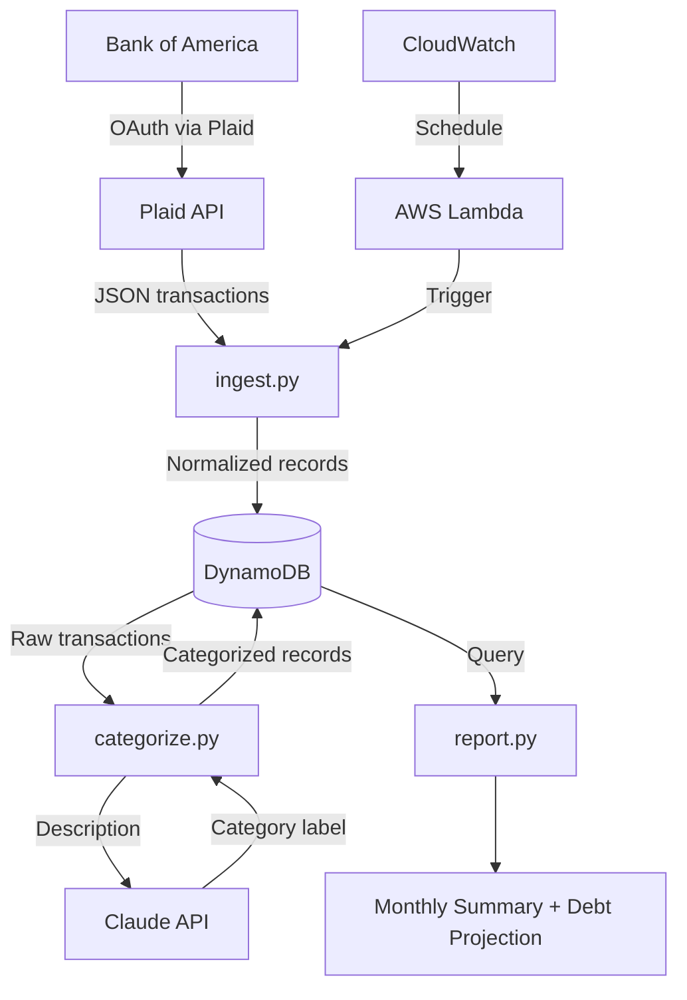

# finance-pipeline

Personal finance data pipeline: BofA → Plaid → DynamoDB → Claude categorization → monthly reports.

Built in 6 weeks as a portfolio project for data engineering roles.

---

## Architecture



| Week | Layer | Status |
|------|-------|--------|
| 1 | Plaid ingestion + repo setup | ✅ Done |
| 2 | DynamoDB write + rule-based categorization | ✅ Done |
| 3 | Lambda + CloudWatch schedule | ✅ Done |
| 4 | Claude API categorization | ✅ Done |
| 5 | Report output | 🔲 |
| 6 | Cleanup + apply | 🔲 |

---

## Setup

```bash
# 1. Clone and install
git clone https://github.com/HarshPatel7x/finance-pipeline
cd finance-pipeline
pip install -r requirements.txt

# 2. Add credentials
cp .env.example .env
# Fill in PLAID_CLIENT_ID and PLAID_SECRET from dashboard.plaid.com

# 3. Run
python -m src.ingest              # Plaid sandbox (requires .env)
python -m src.ingest --sample     # local sample data (no credentials needed)
```

## Environment variables

| Variable | Description |
|----------|-------------|
| `PLAID_CLIENT_ID` | From Plaid dashboard |
| `PLAID_SECRET` | Sandbox or development secret |
| `PLAID_ENV` | `sandbox` / `development` / `production` |
| `ANTHROPIC_API_KEY` | From console.anthropic.com — fallback categorizer when keyword rules return "Other" |

**Never commit `.env`.** Real bank credentials stay local only.
