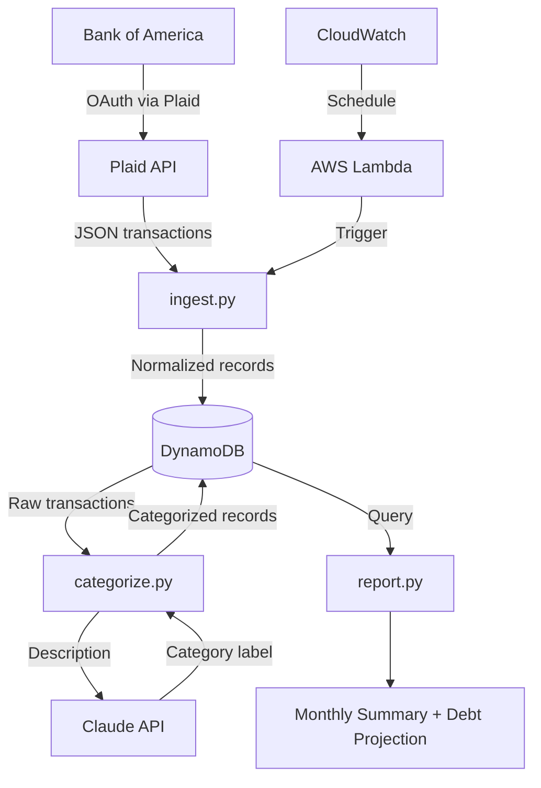

# finance-pipeline

Personal finance data pipeline: BofA → Plaid → DynamoDB → Claude categorization → monthly reports.

Built in 6 weeks as a portfolio project for data engineering roles.

---

## Architecture



| Week | Layer | Status |
|------|-------|--------|
| 1 | Plaid ingestion + repo setup | ✅ Done |
| 2 | DynamoDB write + rule-based categorization | ✅ Done |
| 3 | Lambda + CloudWatch schedule | ✅ Done |
| 4 | Claude API categorization | ✅ Done |
| 5 | Report output | 🔲 |
| 6 | Cleanup + apply | 🔲 |

---

## How I Built This

Plaid as ingestion source, wins against manual CSV uploads with few uncertain factor. Plaid direct connection with the choice of bank can pull data in a certain format, which can stay consitent with designed model. The cost is Plaid subscription and public key expiration.

DynamoDB as datastorage instead of Postgres or SQlite due to its sparse scema, write far outpacing read, single-user, and no joins needed. The tradeoff is its weak query power. Best for limited querying usage such as finance-pipline.

Set up lambda + cloudwatch for scheduled ingestion of the transaction into DynamoDB instade of local cron or EC2. Lamda runs the needed trigger instead of setting up the whole sandbox each time the trigger needs to be triggers, which can be very costly. CloudWatch instead of local cron due to its synergy with Lambda. The cost is, it depends on AWS services. If it the aws service down, everything comes at pause.


Claude API for categorization because transactions are free-text with many variations and a long tail that no rule based keyword map can accomodate. The cost is latency network call per transaction vs dict look ups and it works if 50 txns/month -> $0.001/txn claude haiku but not if 50K txns/month.

Silent degrade-to-other as a fallback for when the Claude API is down or if the category doesn't fit pattern-based keyword map, instead of failing.
---

## Setup

```bash
# 1. Clone and install
git clone https://github.com/HarshPatel7x/finance-pipeline
cd finance-pipeline
pip install -r requirements.txt

# 2. Add credentials
cp .env.example .env
# Fill in PLAID_CLIENT_ID and PLAID_SECRET from dashboard.plaid.com

# 3. Run
python -m src.ingest              # Plaid sandbox (requires .env)
python -m src.ingest --sample     # local sample data (no credentials needed)
```

## Environment variables

| Variable | Description |
|----------|-------------|
| `PLAID_CLIENT_ID` | From Plaid dashboard |
| `PLAID_SECRET` | Sandbox or development secret |
| `PLAID_ENV` | `sandbox` / `development` / `production` |
| `ANTHROPIC_API_KEY` | From console.anthropic.com — fallback categorizer when keyword rules return "Other" |

**Never commit `.env`.** Real bank credentials stay local only.
